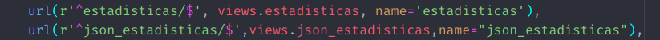
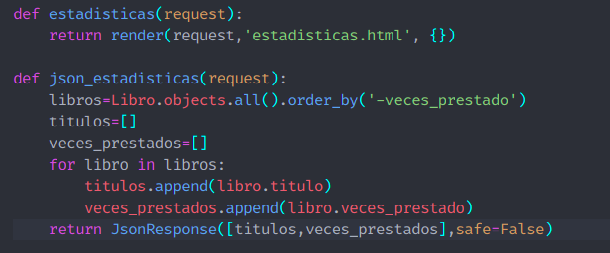
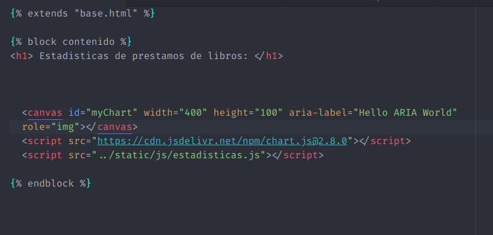
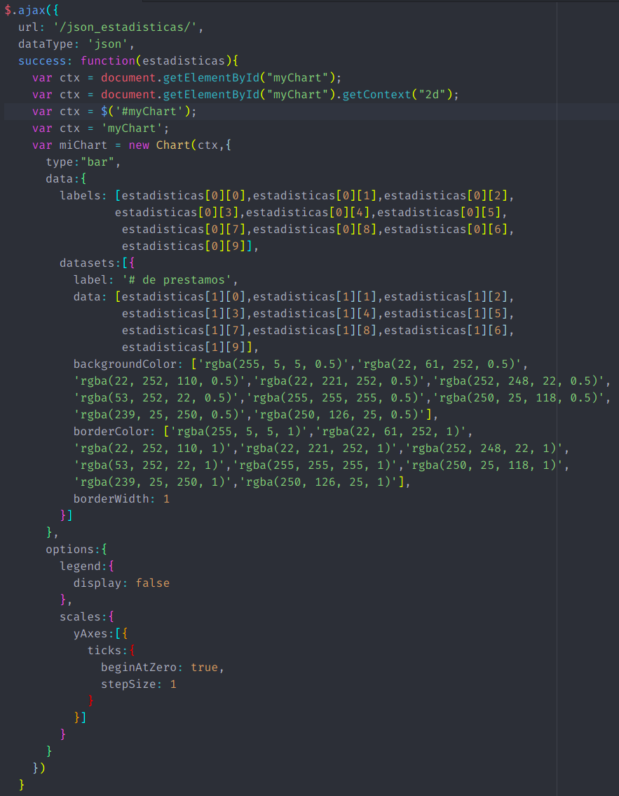
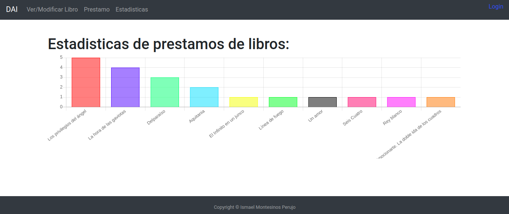
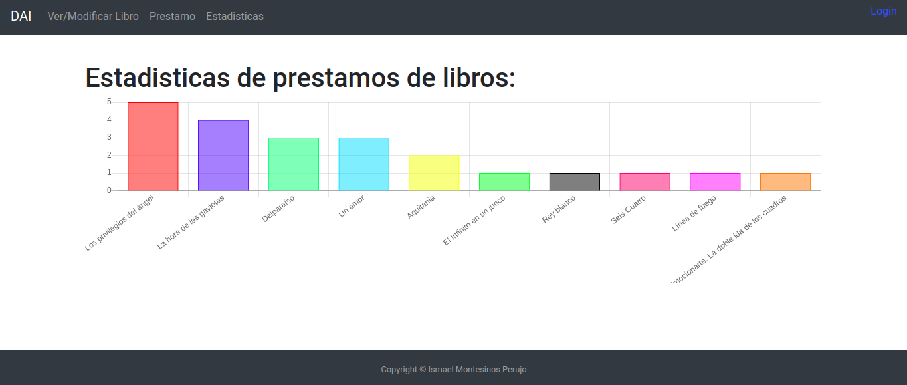

# Practica 10

## Objetivo
En esta práctica completaremos la práctica 7 sobre Django añadiendo una opción de estadísticas para mostrar los 10 libros más prestados, así como una tabla con el número de prestamos de dichos libros. Esto lo conseguiremos usando [Chart.js](https://www.chartjs.org/) como biblioteca para mostrar las tablas. Para esto añadiremos otra página a nuestra web llamada Estadísticas en la barra de navegación. Al entrar a la página, podremos ver directamente la tabla organizada de mayor a menor prestamos. Otras bibliotecas que podríamos haber usado son d3.js, una alternativa más amplia que chart.js, o anychart, de carácter propietario.

## Documentación de la práctica
Lo primero que hemos hecho es añadir el parámetro veces_prestado = models.IntegerField(default=0) para contar cuantas personas han cogido prestado el libro, dos vistas nuevas y dos urls referentes a estas vistas:

En la función json_estadisticas(request) hemos metido todos los libros ordenado por los más veces prestado primero en la variable libros, y creamos dos variables, títulos y veces_prestados, para pasar a nuestro programa en Json, del que hablaremos más adelante. Con respecto a Django, ya tendríamos todo configurado y solo nos queda crear la página web y la conexión con jQuery.

Lo primero que hemos hecho es, obviamente, crear la página estadisticas.html y un enlace desde la barra de navegación

Hemos creado un canvas donde se mostrará la tabla de estadísticas de la biblioteca, y añadimos los cdns y la aplicación jQuery.
Ahora si, solo nos queda la aplicación chart.js, la cual he integrado en ajax:

En ajax llamo al view json_estadisticas creado anteriormente y, en caso de ser una llamada satisfactoria, obtengo el dato 'estadisticas', como return de datos del view. Creamos en contexto del canvas y creamos un nuevo Chart. Esta biblioteca nos permite usar hasta nueve tipos de tablas: Line, Bar, Radar, Pie, Polar area, Bubble, Scatter, Area y Mixed. En mi caso he preferido usar barras (las cuales se pueden poner en horizontal cambiando el tipo a horizontalBar). Lo siguiente que hacemos es definir los datos con el parámetro data. El primer parámetro es el label. Como he querido mostrar solo los 10 más prestados, y están ordenados por más prestados, solo tenemos que mostrar los datos del 0 al 9 del estadisticas[0], es decir, del título. El segundo parámetro del data, es el dataset, es decir los datos puros que, por analogía los defino igual que los labels, cambiando estadisticas[0] por estadisticas[1], que es donde está el número de veces que se ha prestado el libro, y añado la etiqueta label para mostrar la leyenda cuando pasas el ratón por encima. El último parámetro es el tratamiento del color, que he decidido usar una serie de colores distintos por cada label con 0.5 de transparencia, y el mismo color en el borde, pero sin transparencia, así como añadirle 1 al borderWidth.
Después de type y data, podemos definir las opciones. Dentro de la gran cantidad de opciones que nos ofrece la biblioteca, he querido quitar la leyenda, dado que no considero necesaria una leyenda con una tabla tan básica y explicativa por si misma, y un par de parámetros en el eje y: que el primer número de la escala sea 0, y que vaya de unidad en unidad.

## Ejemplo de uso
En un ejemplo de uso, he cogido los 10 libros más vendidos en enero de 2021 para el ejemplo, y he pedido y devuelto una serie de libros de tal manera que quedaría así:

Para demostrar que todo funciona, hago un par de prestamos más con el libro de 'Un amor', con lo que se colocaría 3º o 4º:

